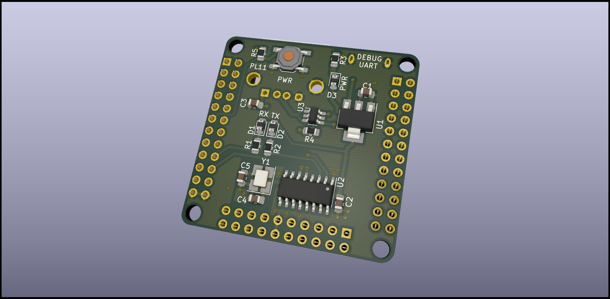

# NanoPI NEO Core Debug shield

This shield provides one USB A and a uart0 via ch340 chip on seperate Micro USB connector

### Armbian Device Tree overlay for power off button on GPIO PL11

gpio-button.dts file contains the overlay. Follow [Armbian docs] to apply it.

[Armbian docs]: https://docs.armbian.com/User-Guide_Allwinner_overlays/
